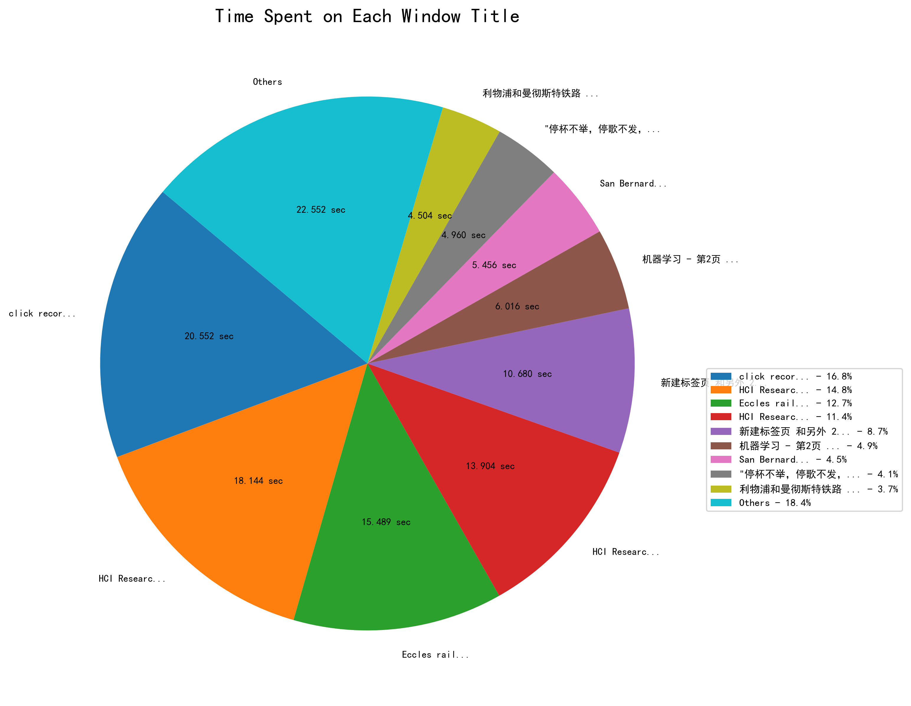
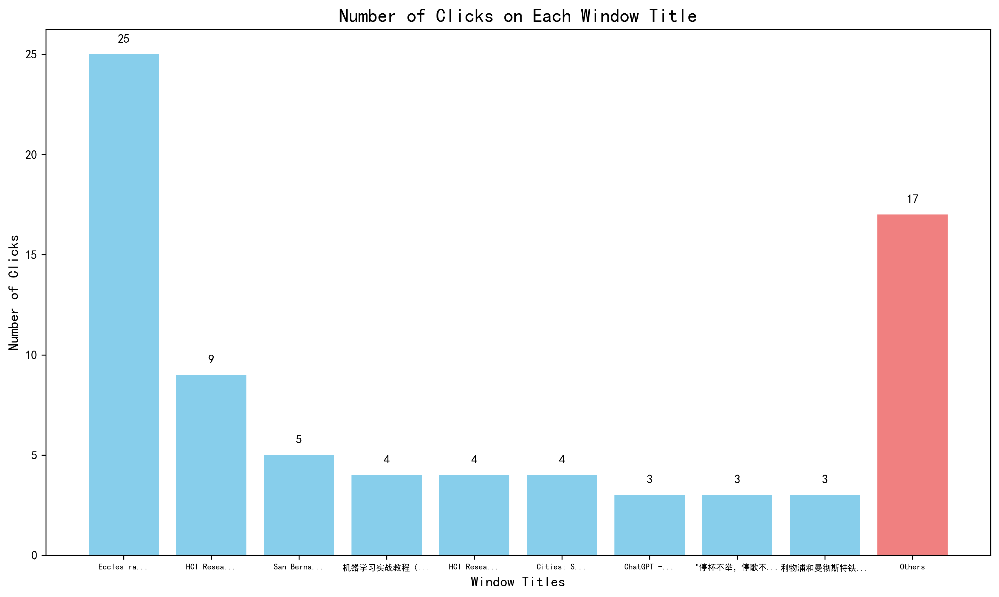
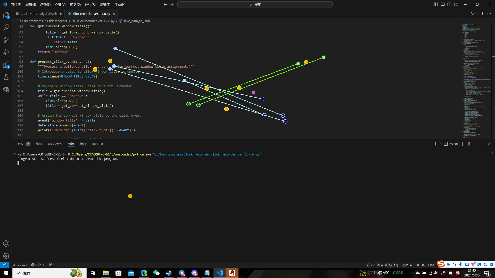

<!--
GPT4o was partially used writing this markdown document. 

This is my first time writing a program for public use, so the documentation could be bad, sorry for that.
--> 

## Developers

Developer: [RumiaTouhou](https://github.com/RumiaTouhou)

Community contributors: Currently none

## Contribution log

If you have made any refinement, please introduce what have you modified and newly implemented below, with the date you create your pull request:

**Currently none**

## Description

This project consists of two main components: an user behavior capture tool (User action capturer.py) and a Jupyter Notebook (Click Data Analysis.ipynb) for analyzing the interaction data captured by the tool. The HCI research tool is designed to record mouse clicks and drags, classify them into different types, and capture their coordinates and timestamps. It also logs the titles of the foreground windows during these interactions and saves all this data into a JSON file. The accompanying Jupyter Notebook processes and visualizes this data, providing insights into user behavior and interaction patterns. This project aims to help developers understand which features of applications or web pages users use the most frequently, and study the interaction patterns between users and applications or web pages. It can also assist HCI researchers in understanding and improving user interfaces by analyzing detailed interaction data.

## Overview

“User action capturer.py” is a specialized tool designed for researchers in the field of Human-Computer Interaction (HCI). This Python program captures detailed user interaction data by recording mouse clicks and drags along with their coordinates and timestamps. Additionally, it logs the titles of the foreground windows during these interactions, providing a comprehensive view of user behavior across different applications. The recorded data is stored in a JSON file for subsequent analysis.

The primary purpose of this project is to facilitate HCI research by providing a robust tool for capturing and analyzing user interaction data. The project consists of two main components:

- **User Action Capturer**: This tool runs in the background, recording all mouse clicks and drags, and classifying them into different types (left click, right click, left drag, right drag). It logs the coordinates and timestamps of these interactions and saves the data into a JSON file. Additionally, it captures the titles of the foreground windows, enabling researchers to understand the context of user interactions.

- **Click Data Analysis**: The accompanying Jupyter Notebook processes the JSON data captured by the HCI Research Tool. It provides various analyses and visualizations, including:

    - Time analysis to determine how long users spend on different window titles.
    - Click count analysis to understand the distribution of user clicks across different windows.
    - Click maps to visualize the spatial distribution of clicks and drags on screenshots of the respective windows.

By using this project, HCI researchers can gain valuable insights into user behavior, identify usability issues, and make informed decisions to enhance user interface design and overall user experience.

## Features

**Key Features of the HCI Research Tool:**

- **Comprehensive Interaction Recording:** Captures all mouse clicks and drags performed by the user, classifying them into four types: left click, right click, left drag, and right drag.
- **Detailed Data Logging:** Records the coordinates and timestamps of all interactions with high precision, ensuring accurate data for analysis.
- **Foreground Window Logging:** Logs the titles of the foreground windows during each interaction, providing context for user actions.
- **JSON Data Storage:** Stores all recorded data in a structured JSON file, making it easy to access and process for further analysis.
- **Screenshot Capture:** Takes screenshots of the active window when interactions occur, especially when a new window title is encountered, ensuring a visual record of the user's interface at the time of interaction.

**Sample JSON record**

```
{
  "session_start_time": "2024-05-30T14:22:15.123456",
  "total_duration": 300.123456,
  "initial_foreground_window_title": "Initial Window Title",
  "actions": [
    {
      "click_index": 1,
      "click_type": "left_click",
      "type_click_index": 1,
      "window_title": "First Window Title",
      "click_time": 0.123456,
      "click_coordinates": {
        "x": 100,
        "y": 200
      }
    },
    {
      "click_index": 2,
      "click_type": "left_drag",
      "type_click_index": 1,
      "window_title": "First Window Title",
      "start_time": 1.234567,
      "end_time": 2.345678,
      "start_coordinates": {
        "x": 100,
        "y": 200
      },
      "end_coordinates": {
        "x": 150,
        "y": 250
      }
    },
    {
      "click_index": 3,
      "click_type": "right_click",
      "type_click_index": 1,
      "window_title": "Second Window Title",
      "click_time": 3.456789,
      "click_coordinates": {
        "x": 200,
        "y": 300
      }
    }
  ]
}

```

**Key Features of the Analysis Notebook:**

- **Time Analysis:**
  - Calculates the time spent by the user on each window title.
  - Visualizes the time distribution using a pie chart, highlighting the windows where the user spent the most time.
- **Click Count Analysis:**
  - Calculates the number of clicks performed by the user on each window title.
  - Visualizes the click distribution using a bar chart, showing the windows with the highest user interaction.
- **Click Map Generation:**
  - Generates click maps for each screenshot, plotting the locations of clicks and drags directly on the images.
  - Differentiates between left clicks, right clicks, left drags, and right drags using distinct colors and markers.
- **User-Friendly Visualizations:**
  - Provides clear and insightful visualizations that help researchers understand user behavior and interaction patterns.
  - Saves the generated charts and click maps in an "Analysis Result" folder for easy access and review.

By leveraging these features, researchers can conduct in-depth analyses of user interactions, identify usability issues, and gather valuable insights to improve user interface design and overall user experience. 

## Required Libraries

**pynput**: Library to control and monitor input devices.
**Pillow**: Python Imaging Library (PIL Fork) for handling images.
**pygetwindow**: Library to get window titles and manipulate windows.
**matplotlib**: Library for creating static, animated, and interactive visualizations in Python.
**notebook**: Jupyter Notebook server and notebook file format.
**keyboard**: Library for hooking and simulating global keyboard events.

Ensure you have installed all of them with pip before you run this program.

## How to use this program?

1. **Start the the Python program**

2. **Activate the Tool:**

   Once the program starts, you will see the message: 

   ```
   Program starts. Press Ctrl + Up to activate the program.
   ```

   Press `Ctrl + Up` to activate the program. You will see the message:

   ```
   Program activated! Record starts. Press Ctrl + Down to terminate this program.
   ```

   After you see this message, you can tell the user start using the program, webpage or functionalities you would like to evaluate. In the meantime, this program will keep running in the background, consistently collecting user's behaviors. 

3. **Recording Interactions:**

   After activation, the tool will start recording all mouse clicks and drags. It will classify the interactions into four types: left click, right click, left drag, and right drag. The tool also logs the coordinates and timestamps of these interactions and the titles of the foreground windows. 

4. **Terminate the Tool:**

   To stop recording, press `Ctrl + Down`. You will see the message:

   ```
   Program closed. All records are saved.
   ```

   The recorded data will be saved in a JSON file named with the system time when the program was activated. Additionally, screenshots will be saved in a folder named "Screenshots - [Activation Time]". All these records are saved in the root folder of the program.

**How to Use the Analysis Notebook:**

1. **Start Jupyter Notebook:**

   Ensure Jupyter Notebook is installed. If not, install it using:

   ```sh
   pip install notebook
   ```

   Start Jupyter Notebook by running the following command in the terminal:

   ```sh
   jupyter notebook
   ```

   If you have installed Visual Studio Code, you can also directly run it in VS Code if you want.

2. **Open the Analysis Notebook:**

   Navigate to the directory containing the analysis notebook (`analysis_notebook.ipynb`). Open the notebook by clicking on its name in the Jupyter Notebook interface.

3. **Run the Cells:**

    The functionalities of each cells were introduced in detailed in the notebook. Please ensure that you put it in the same root folder with your captured json file and screenshot folder stored.

4. **Interpret the Results:**

   The notebook will produce various visualizations to help you interpret the user interaction data:

   - **Time Analysis Pie Chart:** Shows the proportion of time spent on each window title.

      

   - **Click Count Bar Chart:** Displays the number of clicks performed on each window title.

      

   - **Click Maps:** Visual representations of click and drag locations on screenshots, showing interaction hotspots and patterns. They will be visualized and stored in "./[The screenshot folder of your record being analyzed]/Analysis Result" , and the names of the click maps are "M - [The original screenshot name]".

      

## Limitations

**Only Works on Windows System**

The HCI Research Tool and the accompanying analysis notebook rely on libraries and methods that are specific to the Windows operating system. For example, `pygetwindow` and certain functionalities of `pynput` and `keyboard` libraries are designed to work seamlessly on Windows.

This platform dependency restricts the usage of the tool to Windows users only. Researchers and developers using macOS, Linux, or other operating systems cannot utilize this tool for capturing and analyzing user interaction data, which limits its applicability and reach.

Proposed refinement (just a reference):


- Implement platform-specific modules that handle OS-dependent functionalities. The tool can dynamically load and execute the appropriate module based on the detected operating system.
- MacOS: Use `AppKit` for getting the active window title.
- Linux: Use `wmctrl` and `subprocess` to fetch the active window title.
- Use `mss` for taking screenshots across MacOS and Linux.
- Use `pynput` for handling keyboard hotkeys on MacOS and Linux.

**Not Considering Screen Scroll**

The click maps generated by the analysis notebook visualize all the clicks performed on the page as seen in the initial screenshot of the unscrolled window. This approach does not account for any scrolling actions the user might perform during the interaction. Consequently, clicks that happen outside the initially visible area are inaccurately represented as occurring within the initial visible area. In this case, the researchers may misinterpret the user's actual behavior and interaction patterns, leading to incorrect conclusions about how users navigate and interact with the interface, while the click maps may also show misleading interaction hotspots, as clicks performed after scrolling will be inaccurately mapped to the unscrolled view.

Proposed refinement (just a reference):

1. Set up threshold values for scrolling amount and scrolling time to avoid too sensitive scorll detaction. The threshold can be defined and adjusted by actual experiments.
2. Set up a variable called 'scrolled\_this\_window' to count how many scrolls were done in each of the respective unique windows. For each newly accessed pages, the initial value should be 0.
3. Set up a variable called 'window\_was\_scrolled'. When the user accesses a new window or returns to an accessed window by a click or a drag, set this value to 0. Once the user scroll this page, set this value to 1, and no matter how the user furtherly scroll this page, keep this value 1. Once a click or a drag was done in this window and the click did not make the window title to change, and the current value of 'window\_was\_scrolled' = 1, increment 'scrolled\_this\_window' by 1, and take a new screenshot of the page named window title followed by " - SCRn" followed by the current value of 'scrolled\_this\_window', then set the value of 'window\_was\_scrolled' to 0, and next time the user scroll this window, set it to 1 again. If a click or a drag has caused the window title to change while the current value of 'window\_was\_scrolled' = 1, keep 'window\_was\_scrolled' = 1, and once the user access the old window again by a click or a drag, increment 'scrolled\_this\_window' by 1, and take a new screenshot of the page named window title followed by " - SCRn" followed by the current value of 'scrolled\_this\_window', then set the value of 'window\_was\_scrolled' to 0.
4. For the storage of the JSON file, for each piece of click record, also record the current value of 'scrolled\_this\_window' when the click was done (If the page was scrolled when the click occurs, this should be the value after increment).
5. Also update the analysis notebook, so that it would produce the click maps for different scrolled positions of each of the respective pages.

## How to contribute to this project?

If you find any potential bugs or glad to refine its functionalities, pull requests are welcomed. 

The followings are the possible refinement and further implementations you can make:

- Refine documentation of codes and markdowns.
- Implement the behavior capturer works for MacOS and Linux systems.
- Implement the refined program cosidering screen scorlls proposed in the "limitation" section.
- Fix the potential bugs for edge cases if there are any.
- Implement additional analysis for the records in the analysis notebook.
- Implement a similar application recording tap and drag behaviors and the current foreground applications for Android and iOS. 
- Compile this program to an .exe file with proper user interfaces.

Before you submit your pull request, remember to add your ID with hyperlink to your Github homepage to this markdown file and the analysis notebook.

**Extremely important note!!!** 

Even if you are not a native Chinese speaker, **DO NOT** remove the following cell in the analysis notebook:

```
# Comment these two lines by adding '#' before the commands if you encounter font problems in the following cells

plt.rcParams['font.sans-serif'] = ['SimHei']
plt.rcParams['axes.unicode_minus'] = False
```

If you have commented it, before you submit your pull request, remember to decomment them first.
